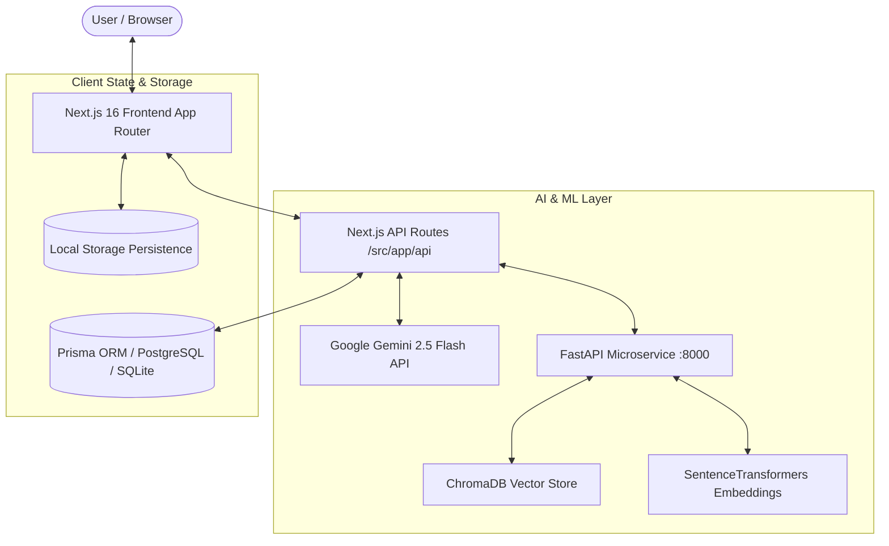

# CookAssistant 🍳 — AI & ML-Powered Culinary Intelligence Platform

[](https://nextjs.org/)
[](https://react.dev/)
[](https://fastapi.tiangolo.com/)
[](https://www.trychroma.com/)
[](https://ai.google.dev/)
[](https://www.typescriptlang.org/)
[](LICENSE)

An enterprise-grade, multimodal AI culinary platform engineered with **Next.js 16 (App Router)**, **Google Gemini 2.5 Flash**, and a **Python FastAPI RAG (Retrieval-Augmented Generation)** microservice. CookAssistant combines Large Language Models, Computer Vision, Word Vector Embeddings, and Real-Time Nutrition Analytics to revolutionize how people plan, cook, and track their meals.

---

## 🌟 Key Features & AI Capabilities

### 1. 🤖 Multimodal AI Recipe Generator (`/generate`)
- Generates structured, gourmet recipes tailored to specific dietary goals (*High Protein, Keto, Vegan, Mediterranean, Balanced*).
- Provides exact ingredient quantities, culinary chemistry tips (Maillard reaction, acid balancing), and bilingual steps.

### 2. 📅 7-Day Smart Meal Planner (`/meal-planner`)
- AI-driven weekly planner balancing calories and macros across 4 daily meals (Breakfast, Lunch, Dinner, Snack).
- Real-time macro aggregation (Calories, Protein, Carbs, Fat).
- **1-Click 7-Day Grocery List Export** with instant clipboard synchronization and `localStorage` persistence.

### 3. 🎯 5D Flavor Matchmaker (`/matchmaker`)
- Interactive swipe-based craving analysis calculating a 5-dimensional sensory flavor vector (**Spice Heat, Umami, Crunch, Richness, Freshness**).
- Computes mathematical similarity against the catalog (`ALL_RECIPES`) to deliver top "Soul-Dish" matches with visual flavor radar breakdowns.

### 4. 🧭 Culinary Adventure Mode (`/adventure`)
- Fusion recipe synthesizer allowing users to mix unpredictable culinary bases, protagonist ingredients, and flavor climaxes.
- Generates scientific cooking secrets, step-by-step timelines, and saves directly to the user cookbook.

### 5. ⚡ Hangry Emergency Station (`/hangry`)
- Ultra-fast cooking engine with appliance filtering (**Microwave, Air Fryer, Toaster, 1-Pan Stovetop, No-Cook**).
- **AI Panic Fridge Rescue**: Type 2–3 ingredients to generate an instant 5-minute meal.

### 6. 👁️ Multimodal Vision Pantry Scanner (`/scan`)
- Multimodal OCR & object recognition detecting ingredients from fridge or pantry photos.
- Interactive tag curation (add/remove detected items) and 1-click sync to your digital pantry.

### 7. 🔄 Smart Substitution & Vector Similarity (`/healthy-swaps`)
- NLP-driven substitution engine using culinary word embeddings and cosine similarity to discover healthy, allergy-safe ingredient swaps.

### 8. 📊 Real-Time Nutritional Analytics (`/analytics`)
- Dynamic Generative UI dashboards powered by **Recharts**.
- Computes daily calorie intake trajectories, macro energy ratios, and cuisine palette distribution from live user activity.
- Includes a seamless **Live Stats vs. Interactive Demo** toggle for showcasing.

### 9. 🎙️ Hands-Free Voice Assistant (`/how-to-cook`)
- Speech synthesis (Text-to-Speech) in English and Hindi for hands-free kitchen navigation.
- Step-by-step guided mode with interactive ingredient checkboxes and integrated timers.

### 10. 🌐 Full Internationalization (i18n)
- Native bilingual support (**English & Hindi**) across all pages, recipes, and UI components via `next-intl`.

---

## 🏗️ System Architecture



---

## 💻 Tech Stack

| Layer | Technologies |
|---|---|
| **Frontend Framework** | Next.js 16 (App Router, Turbopack, React 19) |
| **Styling & Design** | Tailwind CSS, Lucide React, Glassmorphism, Tailwind Animate |
| **Data Visualization** | Recharts (Generative UI charts & responsive dashboards) |
| **Animations & 3D** | Framer Motion, Three.js, React Three Fiber, TSParticles |
| **Backend Microservice** | FastAPI (Python 3.10+), Uvicorn |
| **Vector DB & RAG** | ChromaDB, SentenceTransformers (`all-MiniLM-L6-v2`) |
| **LLM & Vision AI** | Google Gemini 2.5 Flash (`@google/generative-ai`) |
| **Authentication** | NextAuth.js (JWT Strategy, Credentials & OAuth) |
| **Internationalization** | `next-intl` (English `en` & Hindi `hi`) |
| **State Management** | Zustand & LocalStorage Sync |
| **Language & Typings** | TypeScript (Strict Mode) & Python |

---

## 🚀 Getting Started

### Prerequisites
- **Node.js**: `v18.17.0` or later
- **Python**: `3.10` or later
- **Google Gemini API Key**: [Get a free key from Google AI Studio](https://aistudio.google.com/app/apikey)

---

### Installation & Setup

#### 1. Clone the Repository
```bash
git clone https://github.com/UDaygupta12512/cook-assistant-new.git
cd cook-assistant-new
```

#### 2. Install Frontend Dependencies
```bash
npm install
```

#### 3. Setup Python Backend (RAG & Vector Search)
```bash
cd python-backend

# Create virtual environment
python -m venv venv

# Activate virtual environment
# Windows:
.\venv\Scripts\activate
# macOS/Linux:
# source venv/bin/activate

# Install dependencies
pip install -r requirements.txt

# Ingest culinary dataset into Chroma Vector Database
python ingest.py

# Return to root directory
cd ..
```

#### 4. Configure Environment Variables
Create a `.env.local` file in the root directory:

```env
# Google Gemini AI
GEMINI_API_KEY=your_gemini_api_key_here

# NextAuth Configuration
NEXTAUTH_SECRET=your_super_secret_jwt_key_here
NEXTAUTH_URL=http://localhost:3000

# Optional: OAuth Providers
GOOGLE_CLIENT_ID=
GOOGLE_CLIENT_SECRET=
GITHUB_ID=
GITHUB_SECRET=

# Python Microservice Endpoint (Defaults to localhost:8000)
PYTHON_BACKEND_URL=http://localhost:8000
```

---

### Running the Application

#### Terminal 1: Start Next.js Frontend
```bash
npm run dev
```

#### Terminal 2: Start FastAPI Backend
```bash
cd python-backend
.\venv\Scripts\activate
python -m uvicorn main:app --port 8000 --reload
```

Open [http://localhost:3000](http://localhost:3000) in your browser.

---

## 📁 Project Structure

```
cook-assistant/
├── src/
│   ├── app/
│   │   ├── [locale]/             # Bilingual Pages (en / hi)
│   │   │   ├── adventure/        # Culinary Adventure Synthesizer
│   │   │   ├── analytics/        # Nutritional Journey & Recharts
│   │   │   ├── generate/         # AI Recipe Generator
│   │   │   ├── hangry/           # Emergency Speed Cooking Station
│   │   │   ├── health-check/     # TDEE, BMI & Macro Targets
│   │   │   ├── healthy-swaps/    # Smart Substitutions
│   │   │   ├── how-to-cook/      # Step-by-Step Voice Kitchen
│   │   │   ├── matchmaker/       # 5D Flavor Vector Matchmaker
│   │   │   ├── meal-planner/     # 7-Day Smart Meal Planner
│   │   │   ├── my-recipes/       # Personal Saved Cookbooks
│   │   │   ├── nutrition-analyzer/ # Deep Macro Breakdown
│   │   │   ├── pantry/           # Digital Smart Pantry
│   │   │   ├── scan/             # Multimodal Vision Scanner
│   │   │   └── signin/ & signup/ # Authentication Pages
│   │   └── api/                  # Next.js API Routes (AI & Backend Proxies)
│   │       ├── generate-recipe/  # Gemini Recipe Generator
│   │       ├── meal-plan/        # 7-Day Planner Engine
│   │       ├── vision/           # Gemini Multimodal OCR
│   │       └── ...
│   ├── components/               # UI & Feature Components
│   ├── hooks/                    # Custom React Hooks
│   ├── i18n/                     # Translation Dictionaries (en, hi)
│   ├── lib/                      # Culinary Engine, Recipe Data, Auth
│   ├── store/                    # Zustand Stores (Dietary & Pantry)
│   └── types/                    # TypeScript Module Declarations
├── python-backend/               # Python Microservice
│   ├── chroma_db/                # Chroma Vector Store
│   ├── data/                     # Recipe JSON Datasets
│   ├── ingest.py                 # Vector Ingestion Script
│   ├── main.py                   # FastAPI Application
│   └── requirements.txt          # Python Dependencies
├── public/                       # Static Assets & Icons
├── package.json
└── tsconfig.json
```

---

## 🚢 Deployment Guide

### Deploying Frontend on Vercel
1. Push your repository to GitHub.
2. Import the project into [Vercel](https://vercel.com).
3. Add `GEMINI_API_KEY`, `NEXTAUTH_SECRET`, and `NEXTAUTH_URL` in the Environment Variables section.
4. Deploy!

### Deploying Python Microservice on Render / Railway
1. Create a new Web Service pointing to the `python-backend` directory.
2. Build Command: `pip install -r requirements.txt && python ingest.py`
3. Start Command: `uvicorn main:app --host 0.0.0.0 --port $PORT`
4. Set `PYTHON_BACKEND_URL` in Vercel to your deployed FastAPI service URL.

---

## 📄 License

This project is licensed under the **MIT License** — feel free to fork, modify, and build upon it.
